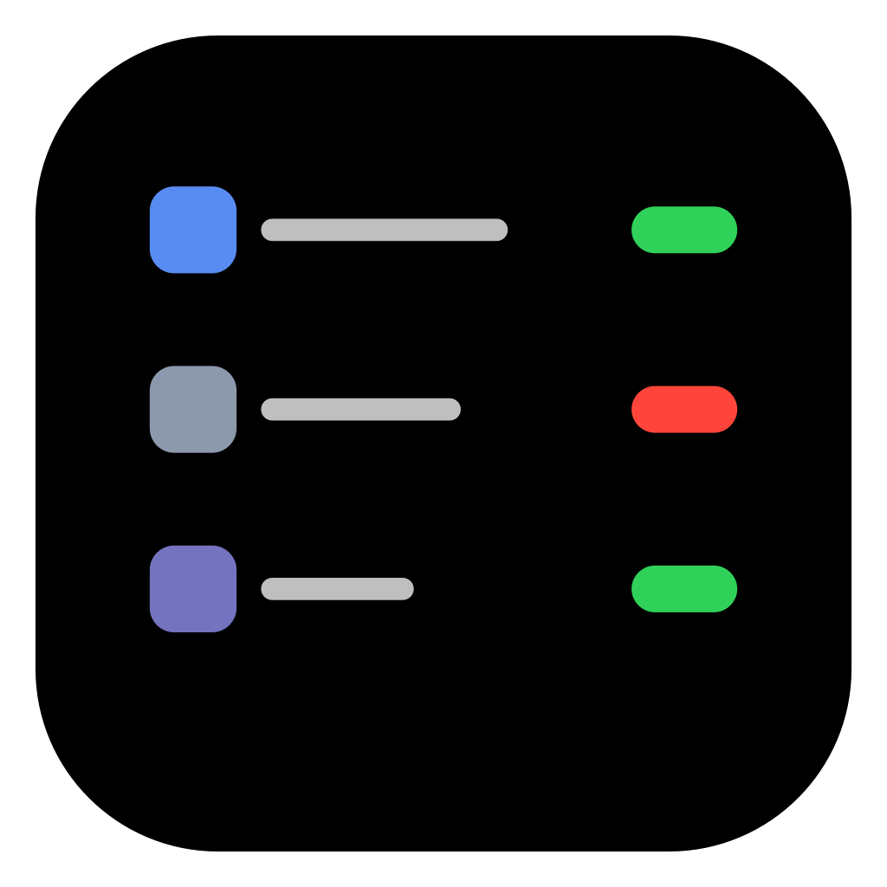

# MacPerms



A native macOS app for inspecting and managing Transparency, Consent & Control (TCC)
privacy permissions — Accessibility, Screen Recording, Full Disk Access, Automation,
Input Monitoring, Camera, Microphone, and ~110 other services — **plus** the
non-TCC permission stores (Local Network, Login Items, Background Items,
App Extensions, Gatekeeper, Location Services, Notifications) — without
navigating System Settings.

Built and verified on **macOS 27.0** (SIP disabled). See `docs/architecture.md` for the
reverse-engineered TCC architecture, `docs/non-tcc-permissions.md` for the other
stores, and `docs/research-notes.md` for sourced research.

> **Warning:** this tool edits security-relevant system stores directly. It never
> silently approves permission requests and every mutation is confirmed and
> verified by read-back — but it is still a power tool for a personal machine,
> not a supported macOS management interface.

## Build & run

```sh
make          # compiles to build/MacPerms.app (CLT only, no Xcode needed)
make run      # builds and launches
```

Requires Command Line Tools with the MacOSX26.5 SDK (the 27.0 SDK's macro-based
SwiftUI needs an Xcode-only plugin the CLT lacks).

## Features

- **By Service / By App** views over every record in both TCC databases —
  the By App view merges TCC records with every Other-store row for the app
- Status pills (Allowed / Denied / Limited / Unknown), provenance (User Consent,
  User Set, System Set, MDM, Entitled…), last-modified, target app for Automation
- **Grant / Revoke / Reset** per record or per app, always behind a confirmation
  sheet; every write is **verified by read-back** and reported
- **Add permission record** for arbitrary apps (bundle-id or executable-path
  clients), with designated-requirement (csreq) generation via `codesign`/`csreq`
- **Privilege model:** the app self-elevates once at launch via
  `osascript … with administrator privileges` and runs the whole GUI as root —
  one auth prompt per launch, then all writes (user + system TCC DBs, helper
  commands) run directly. User-DB writes are direct SQLite; system-DB writes
  go through the bundled `needt`-style privileged path.
- Managed (MDM) rows are read-only; Restart menu for `tccd`, `usernoted`,
  `pkd`, `cfprefsd`, `locationd`, `backgroundtaskmanagementd`, `syspolicyd`,
  `nehelper`; deep links into System Settings privacy panes

## Other Stores section

The sidebar has a second section for permission stores that live **outside** TCC
(each keeps its own reader/writer — nothing is forced through the TCC model):

- **Local Network** — per-app allow/deny rules from the per-user
  `networkprivacy` `NEConfiguration` in `com.apple.networkextension.plist`
  (enforced by `nehelper`). Shows explicit vs implicit choices and the default
  rule. **Allow / Deny / Reset / Remove** — writes via `SCPreferences` as root;
  Remove unrefs the rule from the archive so the record truly disappears.
- **Login Items** — "Open at Login" entries (BTM `login item` records plus
  enabled `app` records — the same set System Settings shows). Service-type
  items get **Enable / Disable** via `launchctl`; `app` records get **Remove**
  via System Events (same as `-` in Settings).
- **Background Items** — every launch agent / daemon / app background task
  from `sfltool dumpbtm`, with per-item **Enable / Disable** via
  `launchctl <domain>/<label>` for launchd-tracked items, plus a labelled
  `sfltool resetbtm` nuclear option.
- **App Extensions** — every `.appex` from `pluginkit` (~500), with name and
  extension point per plug-in. **Enable / Disable** via `pluginkit -e
  use|ignore`, **Reset** via `-e default`, **Remove** via `-r` (unregisters;
  re-registers on next host launch) — all in the console user's pkd domain.
- **Gatekeeper** — all `spctl --list` assessment rules (labels, priorities,
  requirements). Enable/disable/remove by label via `spctl` as root.
- **Location Services** — per-app `Authorized` flags from `/var/db/locationd`
  (root read). **Allow / Deny / Remove** — Remove deletes the client record
  so the app re-prompts.
- **Notifications** — per-app entries from
  `group.com.apple.usernoted.plist` (`apps` array: `flags` bit 25 = allow,
  banner/alert/badge/sound/lockscreen bits decoded). **Allow / Deny** flips
  the allow bit, **Reset** removes the entry; writes restart `usernoted` +
  `cfprefsd`.

All Other-section mutations require confirmation and administrator auth; every
pane states its verification status honestly rather than pretending a write is
supported when it isn't.

## Verified mechanics (docs/architecture.md)

- User TCC.db **moved** in macOS 27 → `/private/var/containers/Data/ProtectedSystem/
  <UUID>/Data/Library/Application Support/com.apple.TCC/TCC.db`; `REG.db` is the
  canonical DB-path registry.
- Direct DB writes take effect **immediately** (probed with `TCCAccessPreflight`:
  0=allowed, 1=denied, 2=unknown) — tccd does live SELECTs; a daemon restart is
  optional belt-and-suspenders, and affected *apps* may still need relaunching
  (kernel-side caching).
- `TCCAccessSetForBundle` & friends SIGTRAP without
  `com.apple.private.tcc.manager.access.*` entitlements (AMFI enforcing) — hence the
  sqlite+elevation design.

## Layout

```
Sources/            SwiftUI app (model, sqlite store, resolver, elevation, views,
                    NEPlist archive surgery, OtherStores readers, OtherViews panes)
Helper/main.swift   needt — privileged helper for non-TCC stores (NE writes via
                    SCPreferences, locationd dump/set, spctl passthrough)
Resources/          tcc-system-write.sh — privileged system-DB write helper
Scripts/            dlsym/call probes used during reverse engineering
Tests/              selftest — exercises the real write path end-to-end
docs/               architecture.md, non-tcc-permissions.md, research-notes.md,
                    services.txt
```

## Safety notes

- All SQL is parameterized/quoted; writes go through a confirmation sheet only.
- Nothing silently approves permission requests — this tool edits stored decisions.
- The app runs as root after the launch-time auth prompt — treat the binary
  accordingly (don't leave stale instances running; quit via Cmd+Q).
- There is no persistent helper daemon; `needt` is invoked per operation by the
  root process.
